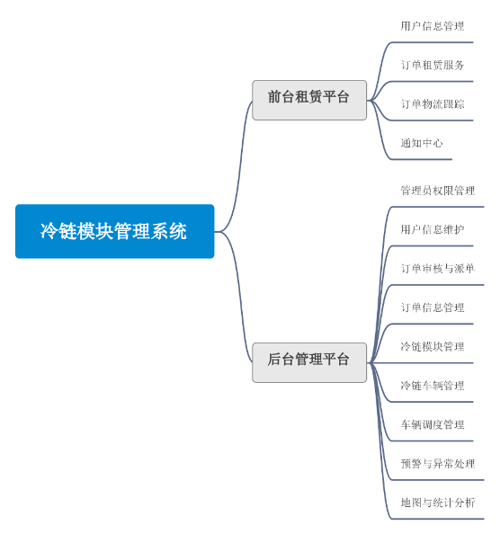
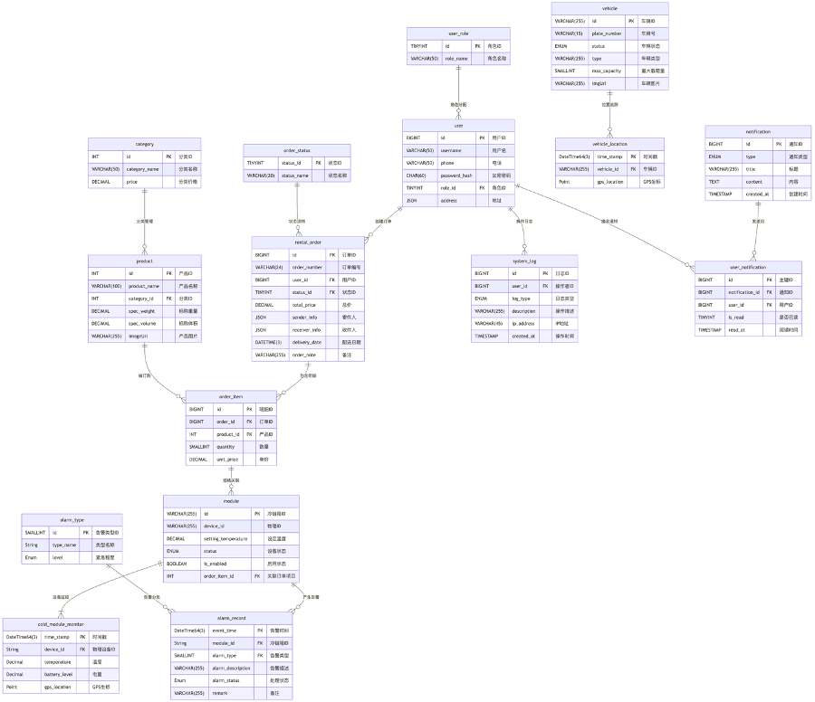
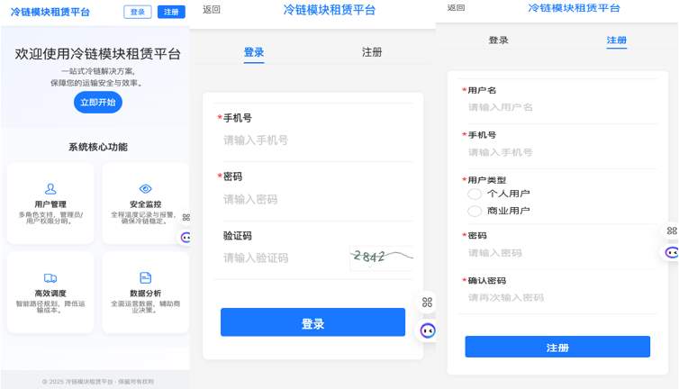
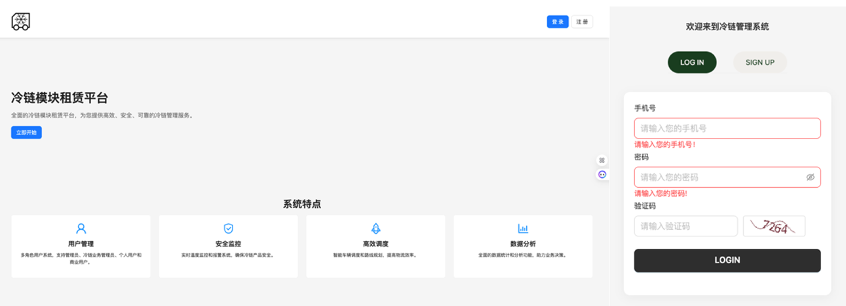
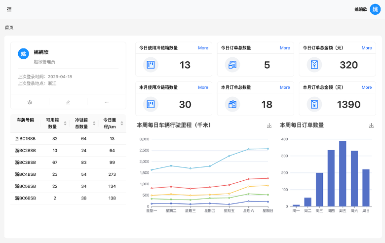
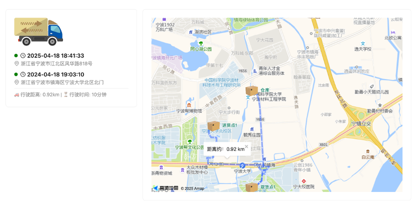
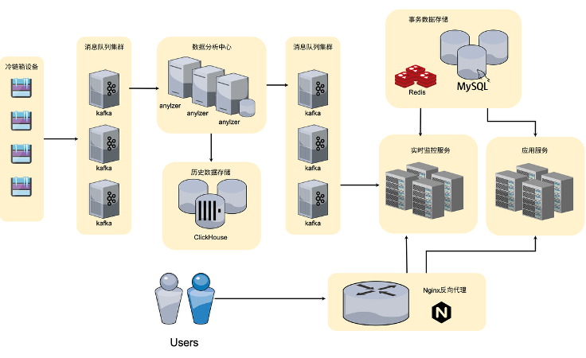

# ColdChain - Modular Intelligent Cold Chain Management System




## Project Overview

**ColdChain** is a modular cold chain logistics management system based on a **frontend-backend separation + microservices architecture**, supporting features such as **cold chain module leasing, real-time monitoring, anomaly alerts, and route planning optimization**.
The system targets scenarios such as fresh e-commerce, ready-made meals, and central kitchens, aiming to improve the intelligence and scheduling efficiency of cold chain transportation.

The system is built with a **React + Go + microservices** technology stack and combines **Greedy + Max-Min Ant Colony Algorithm** for delivery route optimization.
It integrates **Amap (Gaode) Map API** for route visualization and offers excellent **real-time performance, scalability**, and **deployment flexibility**.

---

## Features

### Frontend Leasing Platform (Mobile Web)

* User registration / login
* Cold chain module leasing and order placement
* Real-time tracking of delivery status (location, temperature & humidity, battery level)
* Anomaly alert notifications (temperature control exceptions / device faults / low battery)
* Query of historical orders and notifications



### Backend Management Platform (Web PC)

* Permission management (system admins / business admins)
* Transport order management (approval, dispatch, route planning, exception handling)
* Transport resource management (cold chain modules / vehicles / merchants)
* Visual dashboard (device operation status, fault distribution, transport trajectories)
* System configuration and log management




### Route Planning and Optimization

* Based on the **Pickup-and-Delivery Problem (PDP)** model
* **Greedy algorithm** for fast initial solution generation
* **Max-Min Ant System (MMAS)** iterative optimization for global optimality and stability improvement
* Use of Amap API to obtain real road network distances & route visualization



### Real-Time Data Processing

* **Generator**: generates real-time data of cold chain modules (temperature, battery, location)
* **Analyzer**: anomaly detection and alerting (temperature deviation, low battery, etc.)
* **Monitor**: pushes real-time data via WebSocket
* **Server**: business logic for orders, users, route planning, etc.

---

## Technology Stack

| Layer          | Technologies                                                                                         |
| -------------- | ---------------------------------------------------------------------------------------------------- |
| Frontend       | React + TypeScript + TailwindCSS + Ant Design (PC) / Ant Design Mobile (mobile) + ECharts + Amap API |
| Backend        | Go + Gin + GORM + JWT + Kafka + Redis                                                                |
| Database       | MySQL (structured data) + ClickHouse (time-series data)                                              |
| Route Planning | Python + PyTorch (Greedy + Ant Colony Optimization)                                                  |
| Deployment     | Docker + Docker Compose + Nginx                                                                      |



---

## System Architecture

```
ColdChain/
├── web/                # Backend management system
├── mobile-web/         # Mobile leasing platform
├── server/
│   ├── server/         # Core business service
│   ├── analyzer/       # Real-time data analysis and alerting
│   ├── monitor/        # Real-time data pushing
│   └── generator/      # Data simulation and generation
├── delivery/           # Route planning and algorithm implementation
└── docker-compose.yml  # Container deployment configuration
```

---

## Deployment and Running

### 1. Clone the project

```bash
git clone https://github.com/hstxmgzY/ColdChain.git
cd ColdChain
```

### 2. Start services

One-command start with Docker Compose:

```bash
docker-compose up -d
```

### 3. Run frontend

```bash
cd web
npm install
npm run dev
```

### 4. Run backend

```bash
cd server/server
go run main.go
```

---

If you want, I can help polish or adapt it for a specific audience or platform.


# ColdChain - 模块化智能冷链管理系统


## 项目简介
**ColdChain** 是一套基于 **前后端分离 + 微服务架构** 的模块化冷链物流管理系统，支持 **冷链模块租赁、实时监控、异常告警、路径规划优化** 等功能。
系统面向生鲜电商、预制菜、中央厨房等场景，旨在提升冷链运输的智能化与调度效率。

系统采用 **React + Go + 微服务** 技术栈，结合 **贪心 + Max-Min 蚁群算法** 进行配送路径优化，
集成 **高德地图 API** 实现路径可视化，具备良好的 **实时性、可扩展性** 和 **部署灵活性**。

---

## 功能特性

### 前台租赁平台（移动 Web）
- 用户注册 / 登录
- 冷链模块租赁下单
- 配送状态实时追踪（位置、温湿度、电量）
- 异常告警通知（温控异常 / 设备故障 / 电量低）
- 历史订单与通知查询


### 后台管理平台（Web PC）
- 权限管理（系统管理员 / 业务管理员）
- 运输订单管理（审核、派单、路径规划、异常处理）
- 运输资源管理（冷链模块 / 车辆 / 商户管理）
- 可视化大屏（设备运行状态、故障分布、运输轨迹）
- 系统配置与日志管理


### 路径规划与优化
- 基于 **Pickup-and-Delivery Problem (PDP)** 模型
- **贪心算法**快速生成初始解
- **Max-Min Ant System (MMAS)** 迭代优化，全局最优+稳定性提升
- 高德地图 API 获取真实路网距离 & 路径可视化


### 实时数据处理
- **Generator**：生成冷链模块实时数据（温度、电量、位置）
- **Analyzer**：异常检测与报警（温度偏离、电量不足等）
- **Monitor**：通过 WebSocket 推送实时数据
- **Server**：订单、用户、路径规划等业务处理

---

## 技术栈

| 层级 | 技术 |
|------|------|
| 前端 | React + TypeScript + TailwindCSS + Ant Design (PC) / Ant Design Mobile (移动端) + ECharts + 高德地图 API |
| 后端 | Go + Gin + GORM + JWT + Kafka + Redis |
| 数据库 | MySQL（结构化数据） + ClickHouse（时序数据） |
| 路径规划 | Python + PyTorch（贪心 + 蚁群优化） |
| 部署 | Docker + Docker Compose + Nginx |


---

## 系统架构
```
ColdChain/
├── web/                # 后台管理系统
├── mobile-web/         # 移动端租赁平台
├── server/
│   ├── server/         # 核心业务服务
│   ├── analyzer/       # 实时数据分析与报警
│   ├── monitor/        # 实时数据推送
│   └── generator/      # 数据模拟生成
├── delivery/           # 路径规划与算法实现
└── docker-compose.yml  # 容器化部署配置
```

---

## 部署与运行

### 1. 克隆项目
```bash
git clone https://github.com/hstxmgzY/ColdChain.git
cd ColdChain
```

### 2. 启动服务
使用 Docker Compose 一键启动：
```bash
docker-compose up -d
```

### 3. 前端运行
```bash
cd web
npm install
npm run dev
```

### 4. 后端运行
```bash
cd server/server
go run main.go
```
